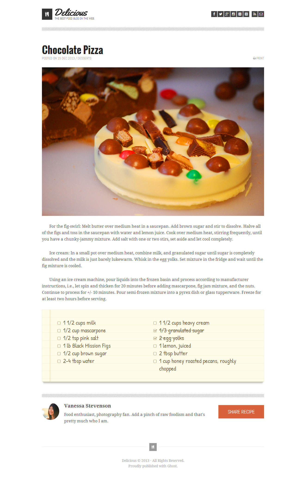

# chocolate-pizza
Pre-work for 301. The goal was to build a website that matches the mockup below. Could not use any negative margins, grids, or flex positioning.
[Link to assignment](https://codefellows.github.io/code-301-guide/curriculum/prework/chocolate_pizza)

## Sources
* [BenchNine Font](https://fonts.google.com/specimen/BenchNine?preview.text_type=custom)
* [Marriweather Font](https://fonts.google.com/specimen/Merriweather?preview.text_type=custom)
* [Nunito Font](https://fonts.google.com/specimen/Nunito?preview.text_type=custom)
* [Oswald Font](https://fonts.google.com/specimen/Oswald?preview.text_type=custom)
* [Pangolin Font](https://fonts.google.com/specimen/Pangolin?preview.text_type=custom)
* [Yellowtail Font](https://fonts.google.com/specimen/Yellowtail?preview.text_type=custom)
* [CSS Strike through](https://www.w3schools.com/cssref/pr_text_text-decoration.asp)
* [CSS text indent property](https://www.w3schools.com/cssref/pr_text_text-indent.asp)